### Research context

During my MSc laboratory work at CIHEAM MAICh, I worked on ongoing research investigating the role of prolyl 4-hydroxylases (P4Hs) in tomato fruit development and ripening. P4Hs catalyze the hydroxylation of proline residues in hydroxyproline-rich glycoproteins, including arabinogalactan proteins (AGPs) and extensins, linking their activity to the post-translational modification and organization of components of the plant cell wall.

The broader research focused particularly on SlP4H and used several genetically modified tomato lines to investigate how altered P4H activity may affect cell-wall properties, fruit development, and ripening. These included RNA-interference silencing lines, overexpression lines, GFP-tagged lines, as well as the development of CRISPR/Cas9 knockout constructs.

My involvement in this work formed part of my day-to-day laboratory activities alongside my MSc thesis project. 

### 1. CRISPR/Cas9 construct development using GoldenBraid

CRISPR/Cas9 knockout constructs targeting *SlP4H3* and *SlP4H6* were developed using the modular GoldenBraid cloning system. Two target-specific spacer sequences were designed for each gene and assembled with the U6-26 promoter and gRNA scaffold to generate individual α1::gRNA1 and α2::gRNA2 expression cassettes. The two gRNA cassettes were subsequently combined into an Ω1 dual-gRNA module, which was then assembled with an Ω2 module containing the Cas9 expression cassette and NPTII selectable marker to generate the final α1 CRISPR/Cas9 construct.

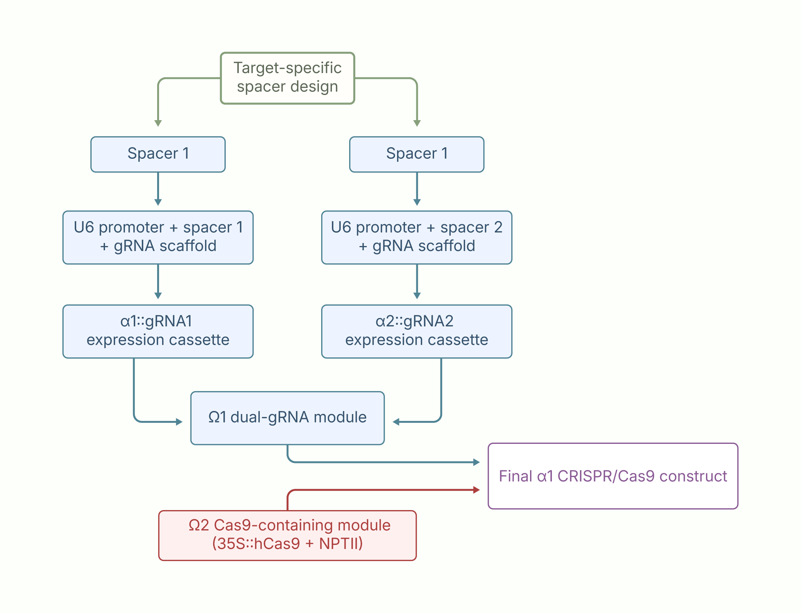

Repeated workflow between GoldenBraid assembly stages: *E. coli* transformation → blue-white screening → plasmid miniprep → validation PCR and agarose gel electrophoresis.

This repeated screening workflow was used to identify candidate recombinant plasmids before progressing to the next assembly stage. Validation PCR provided evidence for the expected inserts based on amplicon size, while definitive verification of the final construct required sequence confirmation.

### 2. Agrobacterium-mediated tomato transformation and tissue culture

*Agrobacterium tumefaciens*-mediated transformation was used to generate transgenic tomato lines carrying the genetic constructs of interest. The process combined sterile plant tissue culture with bacterial inoculation, selection, and regeneration, allowing transformed cells to develop progressively into rooted plantlets that could be transferred to greenhouse conditions.

:::: {.columns .workflow-step}

::: {.column}
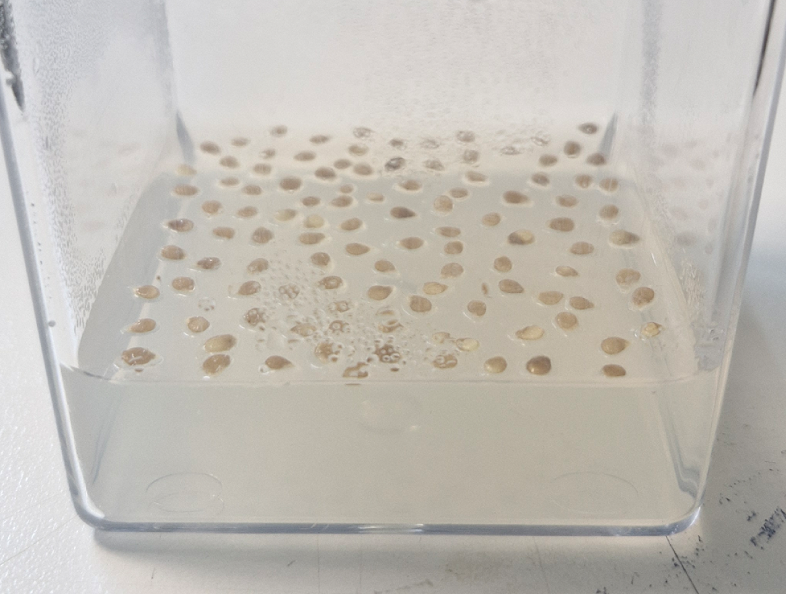{.lightbox width=100%}
:::

::: {.column .workflow-text}
**Seed sterilization and in vitro germination**

Tomato seeds were surface-sterilized and germinated aseptically on Murashige and Skoog (MS) medium. Seedlings were maintained under controlled conditions until cotyledon and hypocotyl tissues were sufficiently developed for use as transformation explants.
:::

::::

 

:::: {.columns .workflow-step}

::: {.column}
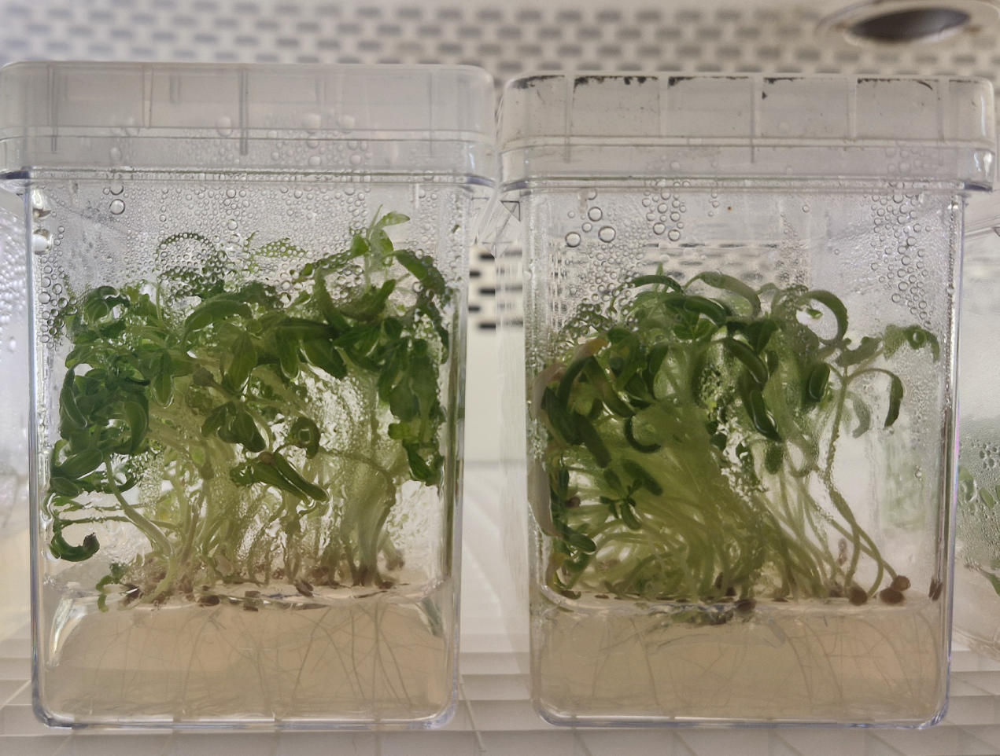{.lightbox width=100%}
:::

::: {.column .workflow-text}
**Explant preparation**

Cotyledons and hypocotyls were excised from sterile seedlings under a laminar-flow hood. Cotyledon ends were removed and hypocotyls were sectioned into small fragments. The prepared explants were placed on KCMS medium before bacterial inoculation.
:::

::::

 

:::: {.columns .workflow-step}

::: {.column}
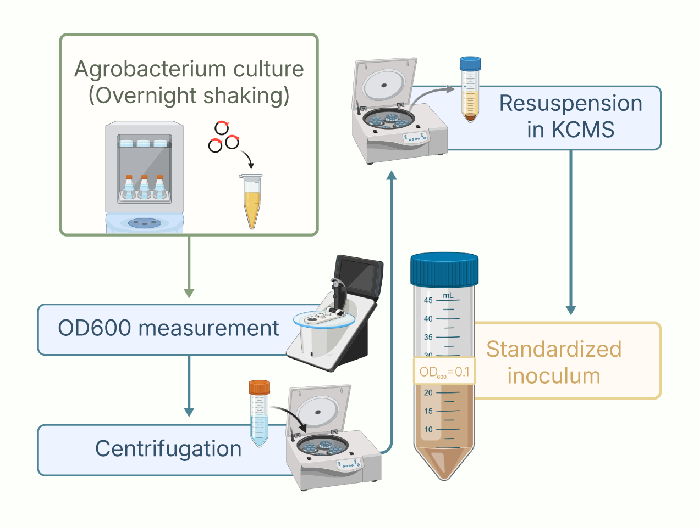{.lightbox width=100%}
:::

::: {.column .workflow-text}
***Agrobacterium tumefaciens* inoculum preparation**

*Agrobacterium* carrying the corresponding genetic construct was cultured in selective LB medium. Bacterial growth was monitored by optical density, after which the cells were collected and resuspended in liquid KCMS medium to prepare a standardized inoculum for plant transformation.
:::

::::

 

:::: {.columns .workflow-step}

::: {.column .workflow-text}
**Explant infection and co-cultivation**

Prepared explants were exposed to the *Agrobacterium* suspension, allowing contact between the wounded plant tissue and bacterial cells. Excess bacterial suspension was removed before the explants were returned to KCMS medium for a dark co-cultivation period, during which T-DNA transfer to plant cells could occur.
:::

::: {.column}
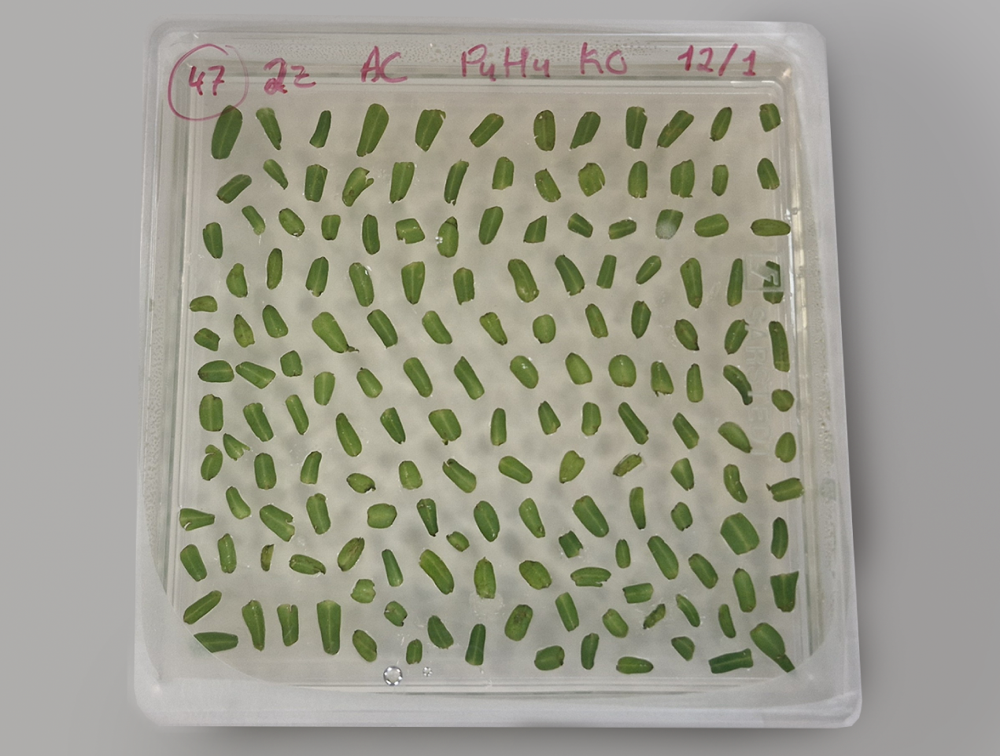{.lightbox width=100%}
:::

::::

 

:::: {.columns .workflow-step}

::: {.column .workflow-text}
**Selection, shoot regeneration, and rooting**

Following co-cultivation, explants were transferred to selective regeneration medium. Antibiotic selection favoured transformed plant cells while suppressing residual *Agrobacterium* growth. Developing calli were periodically transferred to fresh regeneration medium until shoots emerged and were subsequently transferred to rooting medium.
:::

::: {.column}
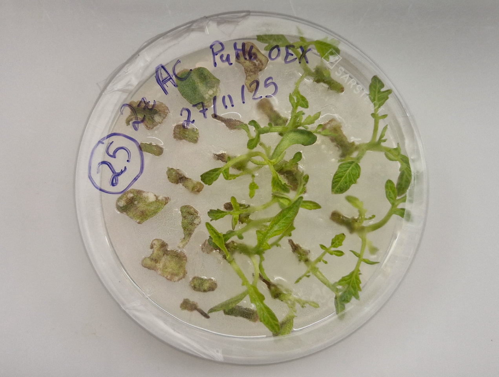{.lightbox width=100%}
:::

::::

 

:::: {.columns .workflow-step}

::: {.column .workflow-text}
**Plant acclimatization**

Rooted plantlets were removed from in vitro culture and progressively acclimatized to ex vitro conditions before transfer to the greenhouse, completing the regeneration of putative transgenic tomato plants.
:::

::: {.column}
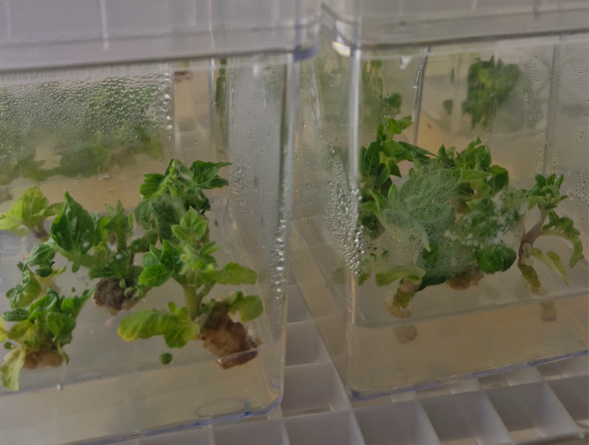{.lightbox width=100%}
:::

::::

### 3. Molecular screening of transgenic lines

Molecular screening was performed to confirm successful transformation and determine the zygosity of regenerated tomato lines. Genomic DNA was extracted from young plant tissue using a CTAB-based method and assessed for concentration and purity using a NanoDrop spectrophotometer. Transformants were initially screened by PCR amplification of the NPTII selectable marker followed by agarose gel electrophoresis to identify positive plants. Confirmed transformants were subsequently analyzed by TaqMan qPCR using NPTII together with the endogenous tomato Invertase gene as a reference.

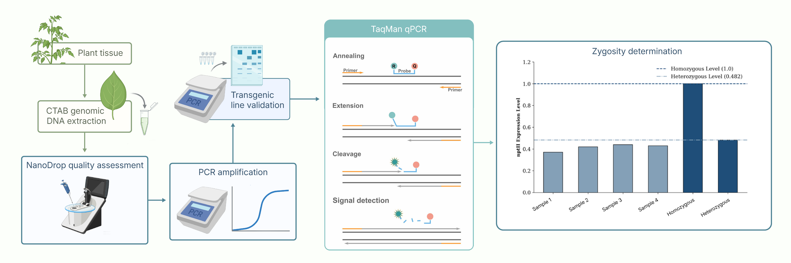

Plants identified as positive transformants by PCR screening were subsequently analyzed by TaqMan qPCR to determine their zygosity.

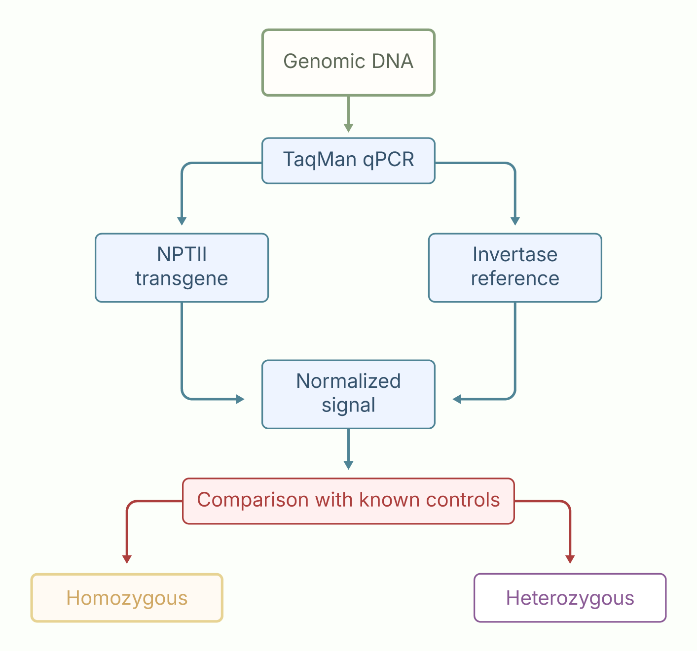{width=65% fig-align="center"}

### 4. Hypoxia treatment and gene expression analysis

As part of the characterization of SlP4H transgenic tomato lines, fruits harvested from greenhouse-grown plants were exposed to controlled low-oxygen conditions using the HypoxyLab system. Fruit tissue was then collected for RNA extraction, followed by RNA quality assessment, cDNA synthesis, and SYBR Green RT-qPCR. This workflow was used to evaluate how selected genes responded to hypoxic treatment in the transgenic lines relative to the wild-type control.

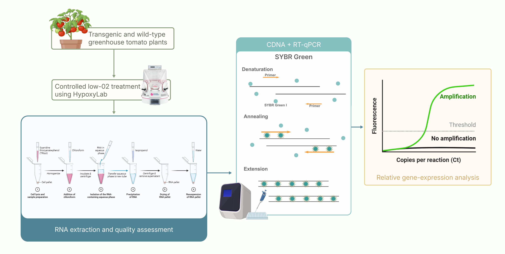

### 5. Protein analysis and immunoblotting

Protein-level characterization was performed using tomato fruit tissue from wild-type and SlP4H transgenic lines. Total proteins were isolated using a phenol-based extraction method and quantified by BCA assay to allow normalization of protein loading prior to SDS-PAGE separation. Following electrophoresis, the separated proteins were transferred to PVDF membranes and probed with specific primary and secondary antibodies. Protein targets were subsequently visualized by chemiluminescent detection, and the resulting band patterns were imaged and evaluated for protein-level differences between the analyzed lines.

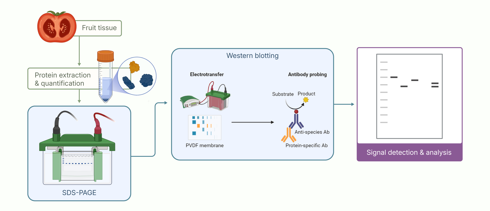{width=100% fig-align="center"}

