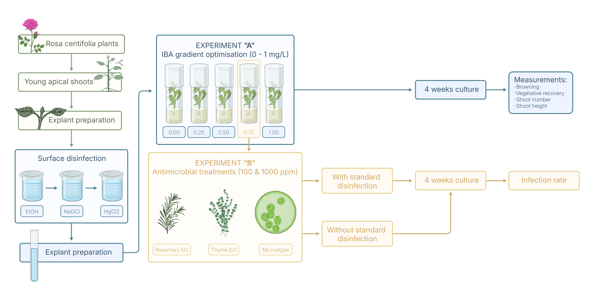

*Rosa centifolia* is an ornamental and aromatic rose valued for essential-oil production and for cosmetic and pharmaceutical applications. Its micropropagation can be difficult to establish because the initiation phase is particularly sensitive to contamination, oxidative browning, and poor explant recovery.

My final-year Agronomy Engineering project focused on improving this early stage of tissue culture. The work examined two linked questions: whether indole-3-butyric acid (IBA) could improve explant establishment, and whether rosemary essential oil, thyme essential oil, or a microalgal consortium could contribute to contamination control as alternatives to conventional surface-disinfection treatments.

## Research objective

The objective of the project was to improve the initiation phase of *Rosa centifolia* micropropagation by balancing explant survival, oxidative browning, shoot development, and contamination control.

The work was organized into two experimental stages. Experiment A tested a gradient of IBA concentrations during culture initiation. Based on those results, Experiment B evaluated alternative antimicrobial treatments under conditions with or without prior laboratory surface disinfection.

## Experimental approach

Young apical shoots were collected from field-grown *Rosa centifolia* plants and prepared as explants for in vitro culture. Explants were surface-disinfected and transferred to Murashige and Skoog (MS) medium containing sucrose and agar.

In Experiment A, five IBA concentrations ranging from 0 to 1 mg/L were tested over a four-week culture period. Oxidative browning, vegetative recovery, axillary shoot number, and shoot height were recorded.

The most promising IBA condition was then carried forward into Experiment B. Rosemary essential oil, thyme essential oil, and a microalgal consortium were tested at 100 and 1000 ppm. The treatments were evaluated both after the standard laboratory disinfection protocol and without prior disinfection, using infection rate as the main outcome.

{.lightbox width=100%}

## Key findings

### Experiment A: 0.75 mg/L IBA gave the most promising initiation response

IBA concentration had its clearest effect on oxidative browning. Browning affected 33.3% of explants in the IBA-free treatment and 40% at 0.25 mg/L, then decreased to approximately 7% at 0.5 mg/L. No browning was observed at either 0.75 or 1 mg/L IBA, and the effect of treatment on browning was statistically significant.

Browning control alone, however, did not guarantee successful establishment. Vegetative recovery ranged from 0 to 40% and did not differ significantly among treatments. Explants grown at 0 or 0.25 mg/L showed wilting and leaf yellowing after four weeks, while those at 0.5 mg/L showed early yellowing. In contrast, explants cultured at 0.75 mg/L remained green and comparatively vigorous, with the joint-highest observed recovery rate. At 1 mg/L, browning was fully suppressed but vegetative recovery failed.

Shoot number and shoot height were not significantly affected by IBA concentration. The main supported effect of IBA was therefore the reduction of oxidative browning rather than stimulation of shoot multiplication or elongation.

Taken together, these responses identified 0.75 mg/L IBA as the most promising condition among those tested. It combined complete suppression of browning with good explant appearance and recovery, while avoiding the failure observed at 1 mg/L. This concentration was therefore selected for the antimicrobial assays.

### Experiment B: alternative antimicrobial treatments could not replace standard disinfection

Rosemary essential oil, thyme essential oil, and the microalgal consortium were tested as potential alternatives for contamination control.

When the treatments were applied alongside the laboratory disinfection protocol, infection rates ranged from 20% to 100%. The standard disinfected control had the lowest infection rate, while the untreated non-disinfected control became completely contaminated. The essential-oil and microalgal treatments produced intermediate infection levels, but did not differ significantly from one another.

The limitation of these treatments became clearer when they were tested without prior laboratory disinfection. Under these conditions, all non-disinfected treatment groups reached 100% contamination after four weeks, regardless of whether rosemary essential oil, thyme essential oil, or microalgae were present. Only the conventionally disinfected control remained free of contamination.

These results showed that the tested alternatives were not sufficient to replace effective surface sterilization. At the same time, explants subjected to the laboratory disinfection protocol during the antimicrobial experiment did not complete vegetative recovery, highlighting an important trade-off between asepsis and phytotoxicity.

## Conclusions and significance

This project showed that successful initiation of *Rosa centifolia* cultures depends on controlling several interacting constraints rather than optimizing a single factor.

IBA was most clearly associated with reduced oxidative browning, and 0.75 mg/L provided the most favourable overall response among the concentrations tested. However, the lack of significant effects on recovery and shoot development means that it should be considered a promising starting point rather than a definitive optimum.

The antimicrobial assays showed that rosemary and thyme essential oils and the tested microalgal consortium could not substitute for conventional surface disinfection. Future optimization should therefore focus on maintaining asepsis while reducing tissue damage, for example by refining sterilization intensity, identifying the microorganisms responsible for contamination, and testing lower-phytotoxicity antimicrobial strategies.

Overall, the study provided an experimental basis for improving the most critical early stage of rose micropropagation: establishing healthy, uncontaminated explants capable of progressing to multiplication and rooting.

