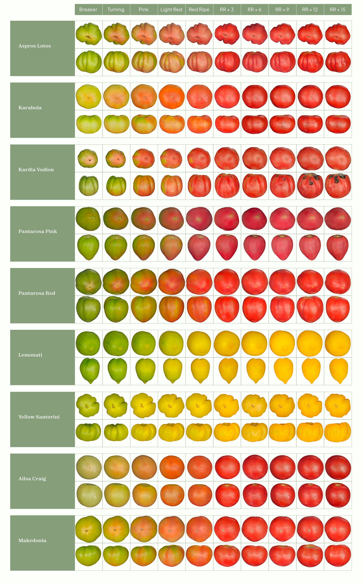
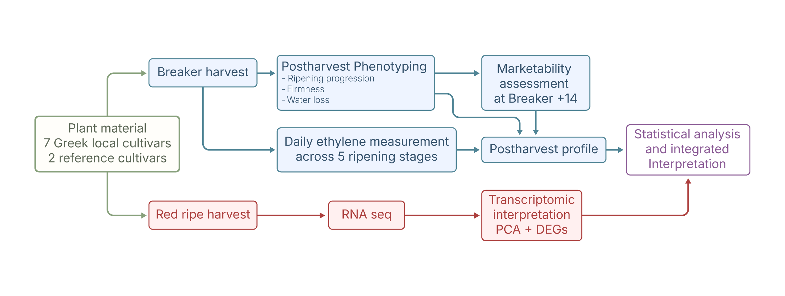
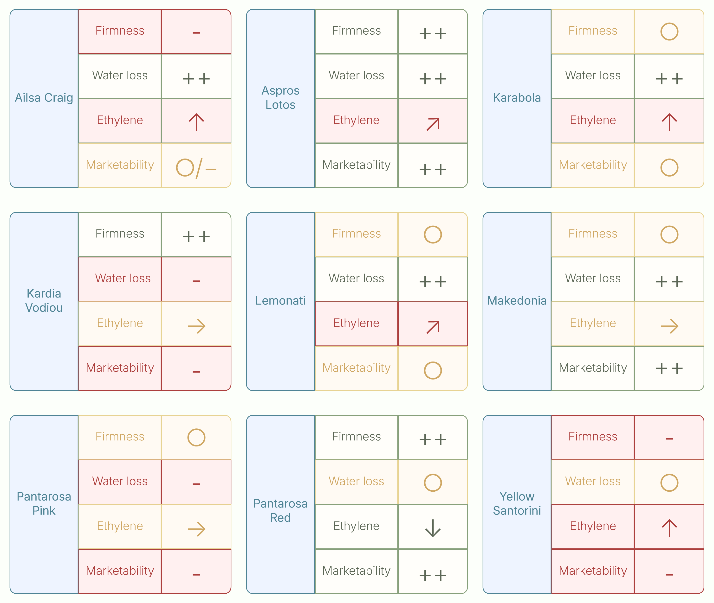
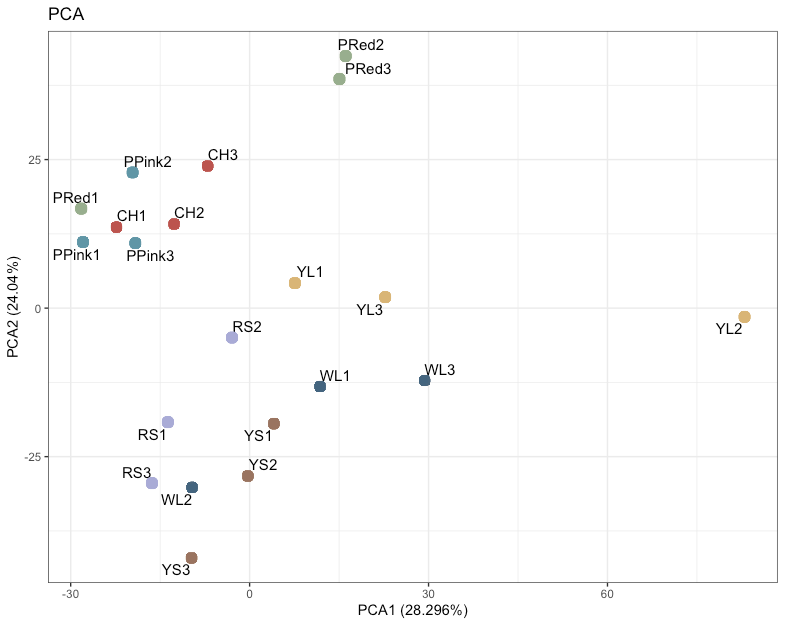

Tomato local cultivars represent valuable sources of genetic diversity that can contribute useful traits for fruit quality and postharvest performance. My MSc research focused on characterizing variation in ripening and postharvest behaviour among seven Greek tomato local cultivars: Aspros Lotos, Karabola, Kardia Vodiou, Lemonati, Pantarosa Pink, Pantarosa Red, and Yellow Santorini, together with the reference cultivars Ailsa Craig and Makedonia.

By combining physiological phenotyping with transcriptomic data, the project aimed to identify contrasting postharvest phenotypes and better understand the traits contributing to cultivar-dependent shelf-life performance.

{.lightbox width=100%}

## Research objective

The objective of this project was to functionally characterize the selected tomato cultivars for traits associated with ripening and postharvest quality.

I examined several interacting traits, including ripening progression, ethylene production, firmness loss, water loss, and fruit overall marketability. This approach allowed the cultivars to be compared not only according to their overall postharvest performance, but also according to the physiological processes contributing to deterioration or quality retention.

Transcriptomic data from red-ripe fruit was also integrated with the physiological results to identify candidate biological processes associated with the contrasting cultivar phenotypes.

## Experimental approach

Fruits were harvested at the breaker stage and maintained under ambient postharvest conditions. Each fruit was followed throughout ripening, allowing cultivar differences in the progression from breaker to red-ripe stage to be recorded.

Postharvest performance was evaluated through several complementary measurements:

* **Ripening progression** was monitored based on external colour development from breaker to red-ripe stage according to USDA colour classification.
* **Fruit firmness** was measured using a Durofel firmness tester to quantify softening during postharvest life.
* **Water loss** was determined from changes in individual fruit weight over the storage period.
* **Ethylene production** was quantified by gas chromatography during fruit ripening.
* **Marketability** was evaluated 14 days after the breaker stage using a visual quality index incorporating firmness loss, shrivelling, decay, and other visible deterioration.

The physiological measurements were complemented with a red-ripe RNA-seq dataset for six of the local cultivars. Differential expression patterns were examined in relation to the observed postharvest phenotypes, with particular attention to processes associated with cell-wall remodelling, fruit-surface and lipid metabolism, stress responses, and ripening.

Statistical analyses and data visualization were performed in R, using analysis of variance and appropriate post-hoc comparisons to evaluate cultivar-dependent differences.

{.lightbox width=100%}

## Key findings

The tomato cultivars displayed distinct ripening and postharvest profiles. Importantly, favourable or poor postharvest performance could not be explained by a single trait: cultivars differed in the relative contributions of ripening rate, ethylene production, firmness retention, water loss, shrivelling, and decay.

### Pantarosa Red: delayed ripening and firmness retention

Pantarosa Red showed the clearest delayed-ripening phenotype among the evaluated cultivars. Fruits required a median of 7 days to progress from breaker to red-ripe, compared with approximately 4–5 days for most other cultivars.

This delayed progression was accompanied by the lowest ethylene production at the breaker stage and the lowest final firmness loss, at 57% after 14 days. Its postharvest appearance was also well maintained: 88% of fruits were classified as highly marketable, while the remaining 12% remained at the acceptable marketability threshold.

Together, these traits characterized Pantarosa Red as a promising delayed-ripening and firmness-retaining phenotype.

### Aspros Lotos: strong overall postharvest performance

Aspros Lotos achieved similarly strong postharvest performance through a different combination of traits.

After 14 days, it showed the lowest water loss among all cultivars, at 4.7%, together with one of the lowest levels of firmness loss. It also had the highest proportion of highly marketable fruits, at 92.31%.

Unlike Pantarosa Red, its favourable postharvest behaviour was therefore associated less with delayed ripening and more with the combined retention of fruit firmness and water.

### Contrasting routes to postharvest deterioration

The poorer-performing cultivars demonstrated that loss of postharvest quality can occur through substantially different physiological routes.

Pantarosa Pink was primarily affected by dehydration. It showed the highest final water loss, reaching 15.6%, and shrivelling was the predominant condition associated with fruits falling below the marketability threshold.

Kardia Vodiou presented a contrasting phenotype. It retained firmness comparatively well but showed high water loss and poor marketability, with deterioration associated mainly with decay and shrivelling. This demonstrated that a fruit can remain mechanically firm while still losing commercial quality through dehydration or surface deterioration.

Yellow Santorini, in contrast, was characterized primarily by rapid ripening and softening. It showed the highest ethylene production at the breaker stage and the greatest final firmness loss, reaching 78.9%. Loss of firmness was also the principal condition associated with its below-threshold fruits.

These contrasting responses indicate that postharvest deterioration in tomato is not a uniform process: similar losses in marketability can arise from softening, dehydration, shrivelling, decay, or combinations of these processes.

### Integrated postharvest performance

A key outcome of the study was that individual postharvest traits did not necessarily change together. In particular, firmness retention and water-loss control were partly independent.

Kardia Vodiou, for example, retained firmness effectively despite substantial water loss, whereas Pantarosa Red showed excellent firmness retention but only intermediate control of water loss. Conversely, cultivars such as Lemonati and Karabola maintained acceptable marketability despite intermediate firmness loss because dehydration, shrivelling, and decay remained comparatively limited.

The cultivars with the strongest overall performance therefore reached similar marketability outcomes through different physiological strategies. Pantarosa Red relied primarily on delayed ripening and firmness retention, whereas Aspros Lotos combined strong firmness retention with particularly low water loss.

{.lightbox width=100%}

### Transcriptomic analysis

An RNA-seq dataset from red-ripe fruit was used as a complementary molecular layer for interpreting the physiological differences among six of the local cultivars: Kardia Vodiou, Pantarosa Pink, Pantarosa Red, Aspros Lotos, Lemonati, and Yellow Santorini.

Principal component analysis showed cultivar-dependent transcriptomic variation, with PC1 and PC2 explaining 28.3% and 24.0% of the total variance, respectively. Some biological replicates showed broader within-cultivar variation, indicating that the transcriptomic profiles were not uniformly separated.

<figure style="margin: 0 0 1rem 0;">
  
  <figcaption style="margin-top: 0.5rem;">
    Principal component analysis of red-ripe fruit transcriptomic profiles across six tomato cultivars.
  </figcaption>
</figure>

Differentially expressed genes identified across cultivar comparisons were associated with several biological processes relevant to postharvest behaviour, particularly:

* **cell-wall remodelling**, including mannanase-, glucanase-, methylesterase-, and pectin lyase-related genes
* **lipid and fruit-surface-associated metabolism**
* **stress and defence responses**

Some transcriptomic patterns were compatible with the physiological observations. For example, genes associated with lipid and surface metabolism differed in Kardia Vodiou and Pantarosa Pink, two cultivars that were particularly susceptible to dehydration.

However, the relationship between transcript abundance and phenotype was not always straightforward. Yellow Santorini showed the greatest final firmness loss despite not displaying the strongest red-ripe expression of several cell-wall-related genes, while cultivars retaining firmness comparatively well also showed higher expression of some cell-wall-associated genes in individual comparisons.

The transcriptomic data were therefore interpreted as a source of candidate biological pathways rather than direct evidence of causal mechanisms. Because the dataset represented only the red-ripe stage, processes occurring earlier during ripening or later during postharvest deterioration may not have been captured.

## Conclusions and significance

This project demonstrated substantial genotype-dependent variation in tomato ripening and postharvest behaviour. Importantly, shelf-life performance emerged from the interaction of several traits rather than from a single physiological determinant.

Among the evaluated local cultivars, Pantarosa Red and Aspros Lotos emerged as the most promising genotypes for further investigation of postharvest quality. Pantarosa Red combined delayed ripening, low breaker-stage ethylene production, strong firmness retention, and high marketability, whereas Aspros Lotos achieved strong postharvest performance through particularly low water loss combined with good firmness retention.

The contrasting behaviour of the remaining cultivars also highlighted distinct routes to postharvest deterioration, including rapid softening, dehydration, shrivelling, and decay.

Together, these results support the value of Greek tomato germplasm as a source of phenotypic diversity that can be further investigated for traits relevant to fruit quality, shelf-life improvement, and the reduction of postharvest losses.
